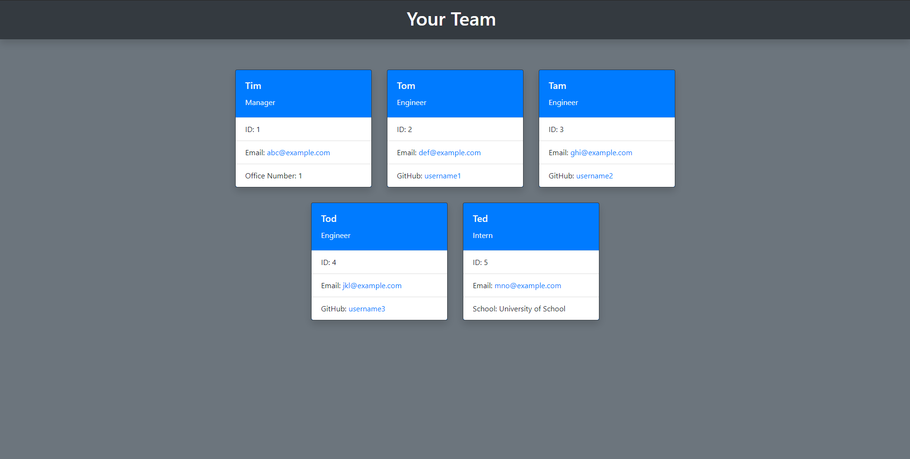

# team-profile-generator

## Description
This is a command line project that will generate an html page to show your team. The team is generated by the users input.

* [Installation](#installation)
* [Contact](#Contact)

## Installation 
    To see installation, usage, and testing, view the video walk through video -
https://youtu.be/DSM6tjI75pY

## Contact
    Contact Me With Any Questions, Comments or Anything else
https://github.com/grey-whitt

## See some test output

[License](./contributor_covenant.md)

Grey Whittenberger 2020